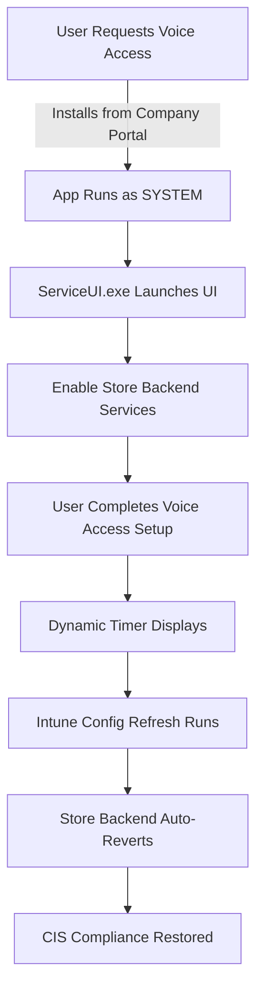
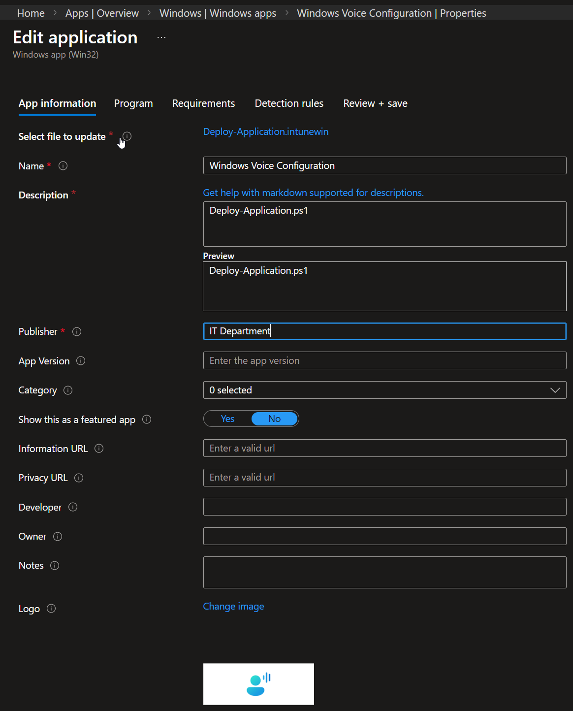
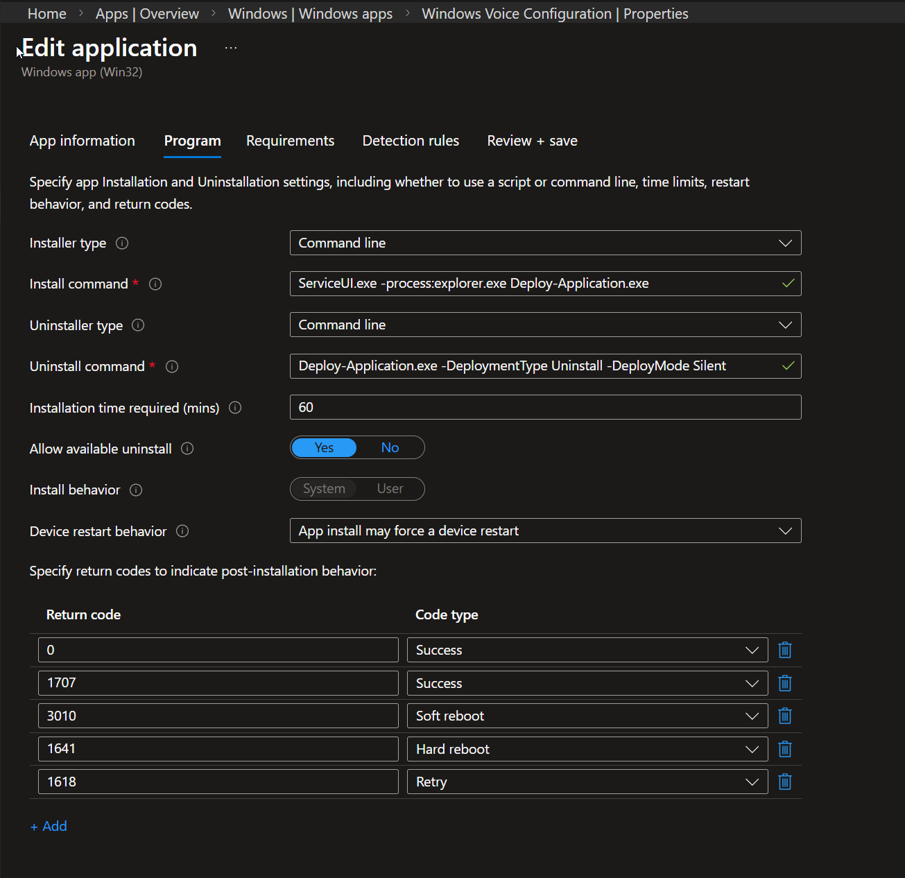
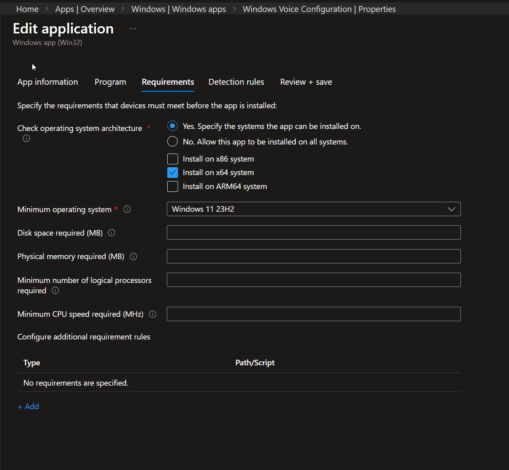
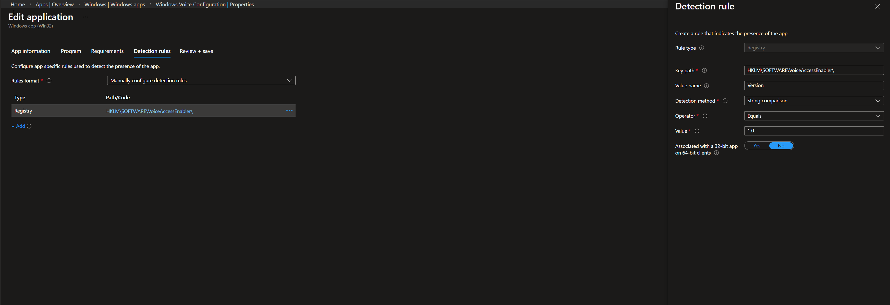
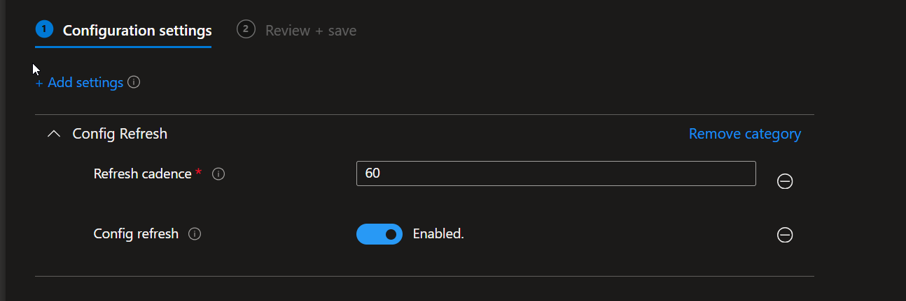

# Windows Voice Access Configuration

An Intune Win32 app that enables Windows Voice Access installation in CIS-compliant environments where the Microsoft Store is blocked.

## Problem Statement

### The Challenge

Organizations implementing CIS (Center for Internet Security) compliance benchmarks commonly block the Microsoft Store to reduce security risks and prevent unauthorized software installations. While this is a sound security practice, it creates accessibility challenges for users who need Windows Voice Access.

**The Conflict:**
- **CIS Compliance:** Microsoft Store must remain blocked (Registry: `RemoveWindowsStore = 1`)
- **User Need:** Accessibility features like Voice Access are critical for users with disabilities
- **Technical Blocker:** Voice Access requires language pack downloads from Microsoft Store backend services
- **Result:** Users cannot install Voice Access even though it's a built-in Windows accessibility feature

### Why This Matters

Voice Access enables hands-free computer control through voice commands, making it essential for:
- Users with mobility impairments
- Workplace accessibility compliance (ADA, Section 508)
- Inclusive technology initiatives

Without a solution, organizations must choose between security compliance and accessibility—an unacceptable trade-off.

## Solution Overview

This solution leverages two Microsoft technologies to provide temporary, controlled Store backend access:

1. **[Intune Config Refresh](https://techcommunity.microsoft.com/blog/windows-itpro-blog/intro-to-config-refresh-%e2%80%93-a-refreshingly-new-mdm-feature/4176921)**: Automatic policy reversion
2. **[PSAppDeployToolkit](https://psappdeploytoolkit.com/)**: Enterprise application deployment framework

### How It Works



### The Technical Approach

#### Phase 1: Temporary Backend Enablement
The app temporarily enables Microsoft Store backend services without exposing the Store UI:

**Registry Changes:**
```powershell
# Enable backend services (was: RemoveWindowsStore = 1)
Set-ItemProperty -Path "HKLM:\SOFTWARE\Policies\Microsoft\WindowsStore" -Name "RemoveWindowsStore" -Value 0

# Allow backend downloads but disable auto-download (was: AutoDownload = 2)
Set-ItemProperty -Path "HKLM:\SOFTWARE\Policies\Microsoft\WindowsStore" -Name "AutoDownload" -Value 4
```

**Service Management:**
```powershell
# Start required Windows Update and Store services
Start-Service -Name "wuauserv"      # Windows Update
Start-Service -Name "InstallService" # Microsoft Store Install Service
Start-Service -Name "ClipSVC"        # Client License Service
```

#### Phase 2: Dynamic Time Calculation
The app calculates real-time countdown until Intune policy refresh by querying the Config Refresh scheduled task:

**How It Works:**
1. **Query Scheduled Task**: Looks for the Intune-created task `"Schedule created by dm client to refresh settings"`
2. **Get Next Run Time**: Retrieves `NextRunTime` from task info
3. **Calculate Minutes**: Computes `[Math]::Round(($taskInfo.NextRunTime - (Get-Date)).TotalMinutes)`
4. **Fallback**: Uses 60 minutes if task doesn't exist or calculation fails

```powershell
$timeRemaining = 60  # Default fallback for non-Intune devices
Try {
    $configTask = Get-ScheduledTask | Where-Object {
        $_.TaskName -eq "Schedule created by dm client to refresh settings"
    } | Select-Object -First 1

    If ($configTask) {
        $taskInfo = Get-ScheduledTaskInfo $configTask
        If ($taskInfo.NextRunTime) {
            $minutesRemaining = [Math]::Round(($taskInfo.NextRunTime - (Get-Date)).TotalMinutes)
            If ($minutesRemaining -gt 0) {
                $timeRemaining = $minutesRemaining
            }
        }
    }
} Catch {
    # Use default 60-minute fallback
}
```

**User Experience:**
Users see accurate countdown in PSAppDeployToolkit dialog:
- *"You have 47 minutes to complete the Voice Access setup wizard. This configuration window will automatically close in 47 minutes."*
- Timer is calculated at runtime, not hardcoded
- Reflects actual Intune policy refresh schedule

#### Phase 3: Automatic Reversion
Intune Config Refresh automatically reverts policies within 60 minutes:
- No manual cleanup required
- No residual security gaps
- Seamless return to CIS compliance

**Uninstall Strategy:**
The uninstall simply removes the detection registry key—Intune handles all policy reversion automatically:

```powershell
Remove-Item -Path "HKLM:\SOFTWARE\VoiceAccessEnabler" -Recurse -Force
# Intune policies automatically revert Store backend changes
```

#### Phase 4: Interactive User Experience
Uses ServiceUI.exe from MDT to enable PSAppDeployToolkit dialogs when running as SYSTEM:

```cmd
ServiceUI.exe -process:explorer.exe Deploy-Application.exe
```

This ensures users see:
- Welcome message with clear instructions
- Dynamic countdown timer
- Voice Access setup guidance
- Completion confirmation

## Deployment Instructions

### Prerequisites
- Microsoft Intune tenant
- Intune Win32 app packaging tool
- Devices running Windows 10/11 with Intune management
- CIS compliance policies blocking Microsoft Store

### Package Contents
```
VoiceAccessEnabler/
├── ServiceUI.exe                           # MDT ServiceUI for SYSTEM context UI
├── Deploy-Application.exe                  # PSAppDeployToolkit executable
├── Deploy-Application-DynamicTime.ps1      # Main deployment script (uses dynamic time calculation)
├── AppDeployToolkit/                       # PSAppDeployToolkit framework
├── Files/
│   └── Enable-Store-Backend-Services.ps1   # Temporary Store backend enablement
└── [Additional PSAppDeployToolkit files]
```

**Note:** The package uses `Deploy-Application-DynamicTime.ps1` as the main deployment script, which calculates real-time countdown based on Intune's Config Refresh scheduled task.

### Intune Configuration

**1. Create Intune Win32 App:**
- App type: Windows app (Win32)
- App package: VoiceAccessEnabler.intunewin

**2. Install Command:**
```cmd
ServiceUI.exe -process:explorer.exe Deploy-Application.exe
```

**3. Uninstall Command:**
```cmd
Deploy-Application.exe -DeploymentType "Uninstall" -DeployMode "Silent"
```

**4. Detection Rule:**
- Rule type: Registry
- Key path: `HKEY_LOCAL_MACHINE\SOFTWARE\VoiceAccessEnabler`
- Value name: `Version`
- Detection method: String comparison
- Operator: Equals
- Value: `1.0`

**5. Requirements:**
- Operating system: Windows 10 1607+ / Windows 11
- Architecture: x64

**6. Assignment:**
- Deployment type: Available
- User context: System
- Install behavior: System

**7. User Experience:**
- Installation time: 60 minutes (allows full Config Refresh cycle)
- Device restart behavior: Determine behavior based on return codes

**8. Config Refresh:**
- Enable Config Refresh with 60-minute cadence
- This ensures automatic policy reversion after Voice Access installation

#### Configuration Screenshots

Below are the complete Intune configuration pages for reference:

**App Information:**


**Program Settings (Install/Uninstall Commands):**


**Requirements (x64, Windows 11+):**


**Detection Rules (Registry):**


**Config Refresh Settings:**


### End User Experience

1. User opens **Company Portal** app
2. Searches for **"Windows Voice Access Configuration"**
3. Clicks **Install**
4. PSAppDeployToolkit welcome dialog appears with:
   - Instructions to complete Voice Access setup
   - Dynamic countdown timer (e.g., "47 minutes remaining")
5. Setup instructions file saved to user's Desktop (works with OneDrive Desktop)
6. User completes Voice Access setup wizard
7. Completion dialog confirms success
8. Intune automatically reverts Store policies within the hour
9. CIS compliance is restored programmatically

## Technical Benefits

### Security
- ✅ Store UI remains blocked throughout process
- ✅ Automatic policy reversion via Intune Config Refresh
- ✅ Time-limited backend access (max 60 minutes)
- ✅ No manual cleanup required
- ✅ Maintains CIS compliance posture

### User Experience
- ✅ Self-service from Company Portal
- ✅ Clear instructions and countdown timer
- ✅ Interactive dialog boxes for guidance
- ✅ No IT intervention required

### IT Administration
- ✅ Deploy once, works automatically
- ✅ Intune handles policy reversion
- ✅ Registry-based detection for supersedence
- ✅ Standard Win32 app deployment
- ✅ No custom compliance scripts needed

## Key Technologies

### Intune Config Refresh
[Microsoft's Config Refresh](https://techcommunity.microsoft.com/blog/windows-itpro-blog/intro-to-config-refresh-%e2%80%93-a-refreshingly-new-mdm-feature/4176921) is a revolutionary MDM feature that automatically reverts policy changes to enforce organizational compliance. Key benefits:

- **Automatic Enforcement:** Policies revert to compliant state within 60 minutes
- **Zero Touch:** No scripts or manual intervention required
- **Reliable:** Built into Intune's core policy engine
- **Tamper Resistant:** Users cannot prevent policy reversion

This makes temporary policy changes safe and manageable—perfect for controlled, time-limited access scenarios like Voice Access installation.

### PSAppDeployToolkit
[PSAppDeployToolkit](https://psappdeploytoolkit.com/) provides enterprise-grade application deployment capabilities:

- **User Interaction:** Professional dialogs and notifications
- **Logging:** Comprehensive installation logs
- **Error Handling:** Robust failure recovery
- **Exit Codes:** Proper return codes for Intune
- **Customization:** Flexible scripting framework

Combined with ServiceUI.exe, it enables interactive user experiences even when running as SYSTEM in Intune.

## Files Breakdown

### Deploy-Application.ps1 / Deploy-Application-DynamicTime.ps1
Main orchestration script that:
- Calculates dynamic countdown from Intune scheduled task
- Runs Enable-Store-Backend-Services.ps1
- Displays PSAppDeployToolkit dialogs with real-time timers
- Sets detection registry key
- Saves setup instructions to the logged-in user's Desktop (supports OneDrive Known Folder Move)
- Logs all operations

#### Desktop Path Detection (SYSTEM Context)
Since the app runs as SYSTEM via Intune, standard Desktop path methods fail. The script uses a multi-step approach to reliably find the user's actual Desktop, even when redirected to OneDrive:

1. **Get logged-in user** from `explorer.exe` process owner (reliable from SYSTEM context, unlike `Win32_ComputerSystem.UserName` which returns null during Intune installs)
2. **Resolve user SID** via `Win32_UserProfile` (works for Azure AD accounts where `Win32_UserAccount` fails)
3. **Read Desktop path** from `HKU\<SID>\...\Shell Folders\Desktop` (contains expanded paths like `C:\Users\<user>\OneDrive - Company\Desktop`)
4. **Fallback** to scanning `OneDrive*\Desktop` folders, then standard `C:\Users\<user>\Desktop`

### Enable-Store-Backend-Services.ps1
Temporarily enables Store backend:
- Sets `RemoveWindowsStore = 0` (enables backend)
- Sets `AutoDownload = 4` (prevents auto-downloads)
- Starts Windows Update and Store services
- Clears Store cache

### ServiceUI.exe
Microsoft Deployment Toolkit utility that:
- Launches processes in user session from SYSTEM context
- Enables PSAppDeployToolkit UI to display from Intune
- Runs Deploy-Application.exe in explorer.exe process

## Troubleshooting

### App Installs Silently
**Issue:** No dialogs appear during installation
**Cause:** ServiceUI.exe not used in install command
**Fix:** Ensure install command is: `ServiceUI.exe -process:explorer.exe Deploy-Application.exe`

### Timer Shows 60 Minutes
**Issue:** Timer always shows 60 minutes instead of actual time
**Cause:** Intune scheduled task not found on device
**Fix:** This is normal on non-Intune managed devices; 60 minutes is the safe fallback

### Store Still Blocked After Install
**Issue:** Store backend doesn't enable
**Cause:** Higher-priority GPO overriding Intune policy
**Fix:** Check GPO precedence; Intune policies may not override domain GPOs

### Voice Access Won't Install Language Pack
**Issue:** Language pack download fails
**Cause:** Backend services didn't start properly
**Fix:** Check event logs; may need to manually start wuauserv, InstallService, ClipSVC

## Repository Structure

```
Windows-Voice/
├── README.md                          # This file
├── VoiceAccessEnabler/                # Source files
│   ├── ServiceUI.exe
│   ├── Deploy-Application.exe
│   ├── Deploy-Application-DynamicTime.ps1
│   ├── Deploy-Application.ps1
│   ├── Install.ps1
│   ├── AppDeployToolkit/              # PSAppDeployToolkit framework
│   ├── Config/                        # Configuration files
│   ├── Files/                         # Helper scripts
│   ├── Strings/                       # Localization
│   └── SupportFiles/                  # Additional resources
└── VoiceAccessEnabler.intunewin       # Packaged .intunewin file (not in repo)
```

## Credits

- **PSAppDeployToolkit:** [https://psappdeploytoolkit.com/](https://psappdeploytoolkit.com/)
- **Intune Config Refresh:** [Microsoft Tech Community Blog](https://techcommunity.microsoft.com/blog/windows-itpro-blog/intro-to-config-refresh-%e2%80%93-a-refreshingly-new-mdm-feature/4176921)
- **ServiceUI.exe Implementation:** Andrew Taylor's [Public Scripts Repository](https://github.com/andrew-s-taylor/public)

## License

This project uses PSAppDeployToolkit which is licensed under the LGPL-3.0 license.

## Support

For issues or questions:
1. Check the Troubleshooting section above
2. Review PSAppDeployToolkit logs in `C:\Windows\Logs\Software`
3. Open an issue in this repository

---

**Created for:** Organizations balancing security compliance with accessibility requirements
**Version:** 1.1
**Last Updated:** February 2026
